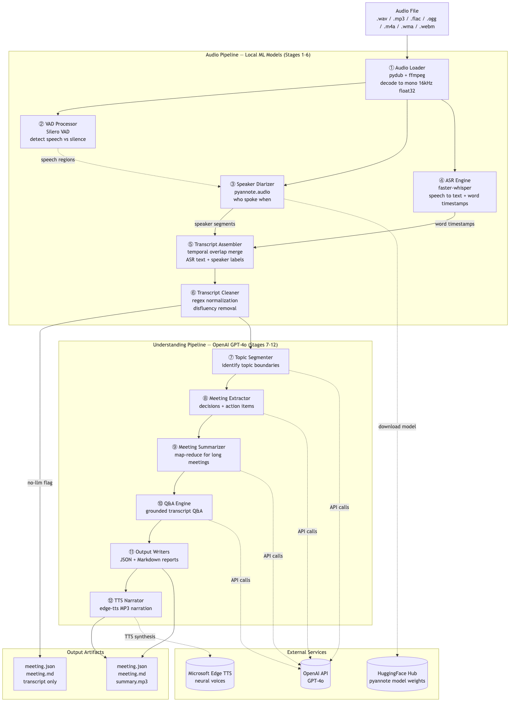

# Meeting Intelligence Agent

Turn pre-recorded meeting audio into structured knowledge: speaker-attributed transcripts, decisions, action items, summaries, and interactive Q&A.

## Table of Contents

- [Architecture Overview](#architecture-overview)
- [Pipeline Stages](#pipeline-stages)
- [Data Models](#data-models)
- [Setup & Installation](#setup--installation)
- [Usage](#usage)
- [Testing](#testing)

---

## Architecture Overview

The system processes audio through a 12-stage pipeline, split into two independent halves:

- **Audio Pipeline** (stages 1-6) — runs locally using ML models, no API calls needed
- **Understanding Pipeline** (stages 7-12) — uses OpenAI GPT-4 for NLP analysis

This separation means you can transcribe once and re-analyze many times without reprocessing audio.

<p  align="center">



</p>  


```
Audio File (.wav, .mp3, .flac, .ogg, .m4a, .wma, .webm)
   │
   ├──[1] Audio Loader ─────────── pydub: decode + normalize to mono 16kHz float32
   ├──[2] VAD Processor ─────────── Silero VAD: detect speech vs silence
   ├──[3] Speaker Diarizer ──────── pyannote.audio: identify who spoke when
   ├──[4] ASR Engine ────────────── faster-whisper: speech → text with word timestamps
   ├──[5] Transcript Assembler ──── temporal overlap merge of ASR + diarization
   ├──[6] Transcript Cleaner ────── regex: disfluency removal, normalization
   │
   │   ── skip_llm boundary (--no-llm stops here) ──
   │
   ├──[7] Topic Segmenter ──────── GPT-4: identify topic boundaries
   ├──[8] Meeting Extractor ─────── GPT-4: extract decisions + action items
   ├──[9] Meeting Summarizer ────── GPT-4: structured summary (map-reduce for long meetings)
   ├──[10] Meeting Q&A ──────────── GPT-4: answer questions about the meeting
   ├──[11] Output Writers ──────── JSON + Markdown report generation
   └──[12] TTS Narrator ────────── edge-tts: optional audio summary playback
```

---

## Pipeline Stages

| Stage | Module | Library | What It Does |
|-------|--------|---------|-------------|
| 1. Load | `audio/loader.py` | pydub | Decodes any audio format → mono 16kHz float32 numpy array |
| 2. VAD | `audio/preprocessor.py` | Silero VAD | Detects speech regions, filters silence |
| 3. Diarize | `diarization/diarizer.py` | pyannote.audio | Labels speaker turns (who spoke when) |
| 4. Transcribe | `transcription/asr.py` | faster-whisper | Speech → text with word-level timestamps |
| 5. Assemble | `transcription/assembler.py` | — | Merges ASR text with speaker labels via temporal overlap |
| 6. Clean | `postprocessing/cleaner.py` | — | Removes "uh", "um", repeated words; normalizes text |
| 7. Segment | `postprocessing/segmenter.py` | GPT-4 | Breaks transcript into topic blocks |
| 8. Extract | `understanding/extractor.py` | GPT-4 | Finds decisions and action items |
| 9. Summarize | `understanding/summarizer.py` | GPT-4 | Generates structured meeting summary |
| 10. Q&A | `understanding/qa.py` | GPT-4 | Answers questions grounded in the transcript |
| 11. Output | `output/` | — | Writes JSON and Markdown reports |
| 12. TTS | `tts/speaker.py` | edge-tts | Narrates summary as MP3 audio |

---

## Data Models

All models live in `src/meeting_intelligence/models/` and use Pydantic v2.

### Audio Models (`models/audio.py`)

```
AudioMetadata    — file_path, duration_seconds, sample_rate, channels, format, file_size_bytes
AudioData        — samples (float32 array), sample_rate, duration_seconds, metadata
SpeechSegment    — start, end, confidence  (+.duration property)
```

### Transcript Models (`models/transcript.py`)

```
Word               — text, start, end, confidence
DiarizationSegment — speaker, start, end
TranscriptSegment  — speaker, start, end, text, words[], confidence
TopicBlock         — topic, summary, segments[], start, end
Transcript         — segments[], speakers[], language, duration_seconds, topic_blocks[]
                     (+.full_text, .speaker_text properties)
```

### Meeting Models (`models/meeting.py`)

```
Decision       — id, text, context, timestamp, participants[], confidence
ActionItem     — id, task, assignee, deadline, priority (high/medium/low), status, confidence
MeetingSummary — title, executive_summary, key_points[], topics_discussed[],
                 participant_count, duration_minutes
QAResponse     — question, answer, relevant_segments[], confidence
MeetingResult  — audio_file, processed_at, transcript, summary, decisions[],
                 action_items[], qa_history[]
```

---

## Setup & Installation

### Prerequisites

1. **Python 3.10+**

2. **ffmpeg** (required for audio format decoding):
   ```bash
   # macOS
   brew install ffmpeg

   # Ubuntu/Debian
   sudo apt install ffmpeg

   # Conda
   conda install ffmpeg
   ```

3. **HuggingFace access** for pyannote diarization:
   - Create an account at https://huggingface.co
   - Accept the terms for [pyannote/speaker-diarization-3.1](https://huggingface.co/pyannote/speaker-diarization-3.1)
   - Generate an access token at https://huggingface.co/settings/tokens

4. **OpenAI API key** (for LLM features):
   - Get one at https://platform.openai.com/api-keys

### Installation

This project uses [uv](https://docs.astral.sh/uv/) for fast, reproducible dependency management. A `requirements.lock` file is included for pinned versions.

```bash
# Install uv (if not already installed)
curl -LsSf https://astral.sh/uv/install.sh | sh

# Clone the project
cd meeting_intelligence_agent

# Create a virtual environment and install all dependencies from the lockfile
uv venv
source .venv/bin/activate    # or .venv\Scripts\activate on Windows
uv pip install -r requirements.lock

# Install the project itself in editable mode
uv pip install -e .

# Install development dependencies (test runner, linting, type checking)
uv pip install -e ".[dev]"

# Set up API keys
cp .env.example .env
# Edit .env with your keys:
#   OPENAI_API_KEY=sk-...
#   HF_TOKEN=hf_...
```

**Regenerating the lockfile** (after changing dependencies in `pyproject.toml`):
```bash
uv pip compile pyproject.toml -o requirements.lock
```

### First Run Note

The first time you run the pipeline, it will automatically download:
- **Silero VAD model** (~2 MB)
- **Whisper large-v2** (~3 GB) — use `model_size: "small"` in config for faster download (~500 MB)
- **pyannote diarization model** (~100 MB)

These are cached locally and reused on subsequent runs.

---

## Usage

### Process a Meeting Recording

```bash
# Full pipeline: transcript + GPT-4 analysis
meeting-intel process recording.mp3

# Specify output directory and expected speaker count
meeting-intel process recording.mp3 -o ./results -s 4

# Auto-detect language (omit -l flag)
meeting-intel process recording.mp3

# Specify language explicitly
meeting-intel process recording.mp3 -l fr
```

### Transcript Only (No API Cost)

```bash
# Skip GPT-4 analysis — only runs audio pipeline (stages 1-6)
meeting-intel process recording.mp3 --no-llm
```

### Ask Questions About a Meeting

```bash
# After processing, ask questions about the meeting
meeting-intel ask output/meeting_20260218_143000.json -q "What did we agree about deployment?"
meeting-intel ask output/meeting_20260218_143000.json -q "Who is responsible for the report?"
```

### Re-Generate Summary

```bash
# Re-run LLM analysis on an existing transcript (no audio reprocessing)
meeting-intel summarize output/meeting_20260218_143000.json
```

### Ask Questions During Processing

```bash
# Process and ask questions in one command
meeting-intel process recording.mp3 \
  -q "What were the main disagreements?" \
  -q "What is the timeline for the project?"
```

### Generate Audio Summary

```bash
# Generate an MP3 narration of the meeting summary
meeting-intel process recording.mp3 --tts
```

### Verbose Mode

```bash
# Enable debug logging to see all pipeline details
meeting-intel -v process recording.mp3
```

### Custom Config

```bash
# Use a custom configuration file
meeting-intel --config my_config.yaml process recording.mp3
```

### Example Output

After processing, the `output/` directory will contain:

```
output/
├── meeting_20260218_143000.json     # Full structured data (machine-readable)
├── meeting_20260218_143000.md       # Human-readable report
└── summary_20260218_143000.mp3      # Audio summary (if --tts used)
```

The **Markdown report** includes:
- Meeting title, date, duration, speaker count
- Executive summary
- Key points (bulleted list)
- Topics discussed
- Decisions table (decision, participants)
- Action items table (task, assignee, deadline, priority)
- Full transcript with timestamps and speaker labels

---

## Testing

All 155 unit tests run locally with mocked external services — no API keys, model downloads, or network access required.

```bash
# Run all tests
pytest

# Run with verbose output
pytest -v

# Run a specific test file
pytest tests/test_assembler.py -v

# Run a specific test class or method
pytest tests/test_pipeline.py::TestPipelineProcess::test_full_pipeline -v

# Run with coverage report
pytest --cov=meeting_intelligence --cov-report=term-missing

# Skip integration tests (those requiring models/API keys)
pytest -m "not integration"

# Run only fast pure-logic tests (no mocking needed)
pytest tests/test_models.py tests/test_cleaner.py tests/test_assembler.py tests/test_config.py -v
```
---